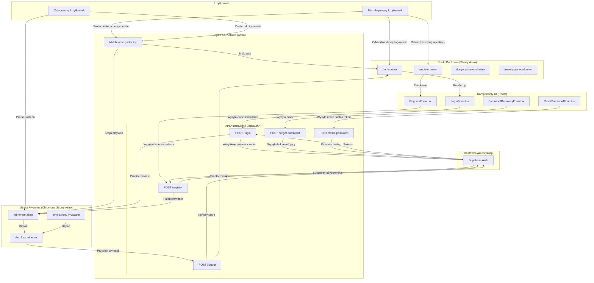

<architecture_analysis>
Na podstawie dostarczonych dokumentów (`prd.md`, `auth-spec.md`) oraz zasad tworzenia diagramów (`mermaid-diagram-ui.mdc`), przeprowadzono analizę architektury UI dla modułu autentykacji.

### 1. Komponenty i Strony

Zidentyfikowano następujące elementy UI:

**Strony Publiczne (Astro):**
- `src/pages/login.astro`: Strona logowania.
- `src/pages/register.astro`: Strona rejestracji.
- `src/pages/forgot-password.astro`: Strona do inicjowania resetu hasła.
- `src/pages/reset-password.astro`: Strona do ustawiania nowego hasła po resecie.

**Komponenty Interaktywne (React):**
- `LoginForm.tsx`: Formularz logowania z walidacją po stronie klienta.
- `RegisterForm.tsx`: Formularz rejestracji z walidacją.
- `PasswordRecoveryForm.tsx`: Formularz do wysyłania prośby o reset hasła.
- `ResetPasswordForm.tsx`: Formularz do zmiany hasła przy użyciu tokenu.

**Layouty (Astro):**
- `src/layouts/Layout.astro`: Główny layout dla stron publicznych.
- `src/layouts/AuthLayout.astro`: Layout dla stron wymagających autoryzacji.

**Middleware (Astro):**
- `src/middleware/index.ts`: Oprogramowanie pośredniczące, które chroni trasy prywatne i zarządza sesją.

### 2. Główne Strony i Powiązane Komponenty

- Strona `/login` renderuje komponent `LoginForm`.
- Strona `/register` renderuje komponent `RegisterForm`.
- Strona `/forgot-password` renderuje komponent `PasswordRecoveryForm`.
- Strona `/reset-password` renderuje komponent `ResetPasswordForm`.
- Strony takie jak `/generate` (i inne prywatne) będą używać `AuthLayout.astro` i będą chronione przez middleware.

### 3. Przepływ Danych

1.  **Użytkownik** wchodzi na jedną ze stron publicznych (np. `/login`).
2.  **Strona Astro** (`login.astro`) renderuje odpowiedni **komponent React** (`LoginForm`).
3.  Użytkownik wypełnia formularz. **Komponent React** waliduje dane po stronie klienta.
4.  Po pomyślnej walidacji, komponent wysyła żądanie (np. `POST`) do odpowiedniego **API endpointu** (np. `/api/auth/login`).
5.  **API endpoint** (Astro) przetwarza żądanie, komunikując się z **Supabase Auth** w celu weryfikacji poświadczeń.
6.  Po pomyślnej autentykacji, Supabase tworzy sesję (zapisywaną w `HttpOnly cookie`).
7.  Aplikacja frontendowa przekierowuje użytkownika na stronę prywatną (np. `/generate`).
8.  Żądanie dostępu do strony prywatnej jest przechwytywane przez **Astro Middleware**.
9.  **Middleware** weryfikuje sesję użytkownika na podstawie cookie. Jeśli sesja jest ważna, dostęp jest przyznawany. W przeciwnym razie, użytkownik jest przekierowywany na stronę logowania (`/login`).

### 4. Funkcjonalność Komponentów

- **LoginForm/RegisterForm**: Zbieranie i walidacja danych uwierzytelniających, obsługa stanu ładowania i błędów, komunikacja z API.
- **PasswordRecoveryForm**: Zbieranie adresu e-mail i wysyłanie żądania o link do resetu hasła.
- **ResetPasswordForm**: Umożliwienie użytkownikowi ustawienia nowego hasła na podstawie tokenu z linku.
- **Middleware**: Centralny punkt kontroli dostępu do zasobów chronionych.
- **AuthLayout**: Wspólna struktura dla wszystkich stron po zalogowaniu, potencjalnie zawierająca nawigację i przycisk wylogowania.
</architecture_analysis>

<mermaid_diagram>

</mermaid_diagram>
